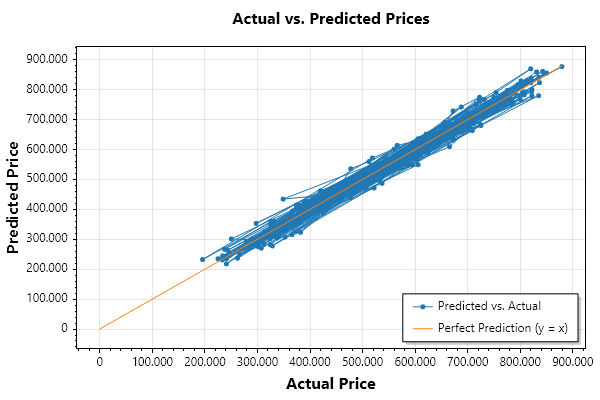
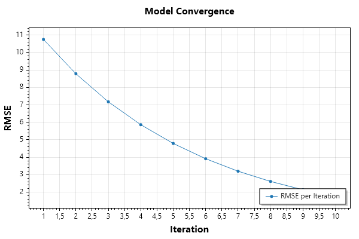

# ML.NET Real Estate Price Prediction

## Overview
This project is a **.NET 8** application using **ML.NET** to predict real estate prices based on property features. It follows **Test-Driven Development (TDD)** principles and includes **cross-validation, feature engineering, and hyperparameter tuning** to improve model accuracy.

## 🔧 Tech Stack
- **.NET 8**
- **ML.NET** (Machine Learning)
- **ScottPlot** (for data visualization in tests)

## 📊 Dataset
The dataset contains **synthetic real estate data**, including:
- `Rooms` (Number of rooms)
- `Bathrooms` (Number of bathrooms)
- `SquareMeters` (Total area in square meters)
- `YearBuilt` (Construction year)
- `Price` (Target variable)

## 🚀 Features
✅ **Preprocessing & Feature Engineering**  
✅ **Train-Test Split (70-30%)**  
✅ **Cross-Validation (K-Fold: 5)**  
✅ **Hyperparameter Tuning**  
✅ **FastTree Regression Model**  
✅ **Performance Evaluation (RMSE, R², Feature Importance)**  
✅ **Convergence & Overfitting Checks**  
✅ **Graphical Analysis (ScottPlot)**  

## 🔄 Training & Evaluation
To train and evaluate the model, run:
```sh
# Run the training and evaluation process
 dotnet test
```

## 🖼 Visualizations
The project includes **actual vs. predicted plots** and **convergence plots** to analyze model performance.

### **Example: Actual vs. Predicted Prices**


### **Example: Model Convergence**


## 🏗 Project Structure
```
📂 MlNetRealState
│── 📂 MlNetRealState.App (ML Model & Business Logic)
│── 📂 MlNetRealState.Tests (Unit Tests)
│── 📄 README.md (Project Documentation)
│── 📄 real_estate_data.csv (Dataset)
```

## 🛠 How to Run the Project
1️⃣ **Clone the Repository:**
```sh
git clone https://github.com/your-username/ml-net-real-estate.git
cd ml-net-real-estate
```

2️⃣ **Install Dependencies:**
```sh
dotnet restore
```

3️⃣ **Run Unit Tests:**
```sh
dotnet test
```

4️⃣ **Train & Evaluate Model:**
```sh
dotnet run
```

## 🎯 Future Improvements
- Implement **Neural Network Regressor (ML.NET DNN Trainer)**.
- Experiment with **different regression models**.
- Improve dataset quality for better predictions.

---

📌 **License:** MIT License
